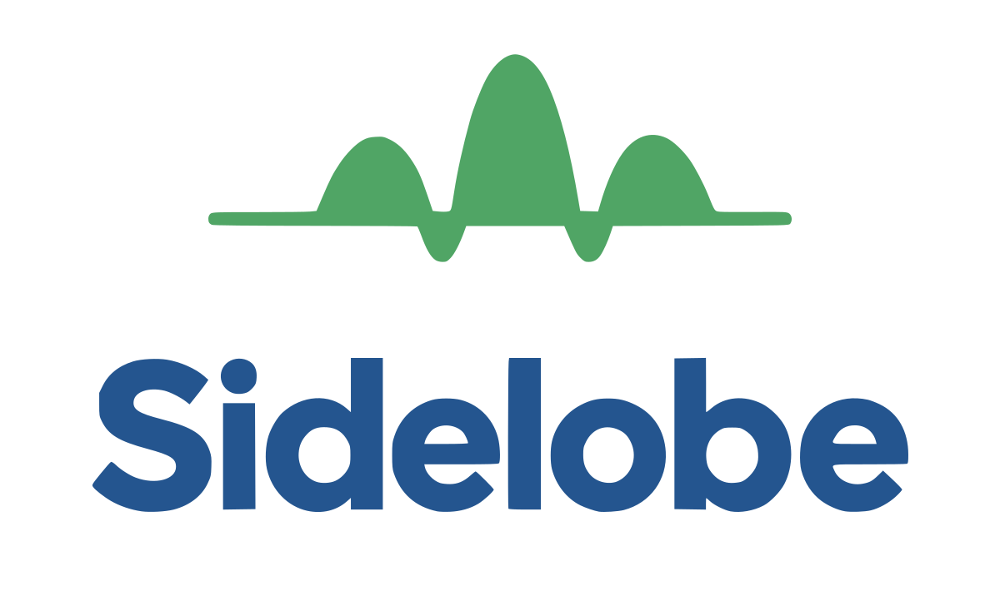

  

  <strong>Small software. Built properly.</strong> 
  Independent software studio · Europe

  <a href="https://sidelobe.dev">sidelobe.dev</a>
  ·
  <a href="mailto:hello@sidelobe.dev">hello@sidelobe.dev</a>

---

Sidelobe builds focused products and on-demand applications for workflows that do not fit off-the-shelf software. We turn specific operational problems into small, maintainable tools people can actually use.

### What we build

- **Custom web applications** for focused operational workflows
- **Internal tools** that replace spreadsheet-heavy or manual processes
- **Workflow automation** that connects systems and removes repetitive work
- **Product prototypes** designed to become production software, not throwaway demos
- **Mobile applications** where the workflow belongs on the go

### Products

**KorpoAppka** — office presence and attendance planning without spreadsheet chaos. Currently in active development.

### Public repositories

- [website](https://github.com/sidelobe-labs/website) — source for the Sidelobe website and deployment
- [.github](https://github.com/sidelobe-labs/.github) — organization profile and shared repository defaults

Product, infrastructure and internal brand repositories are private by design.

### Working principles

**Focused scope. Production-minded from day one. Clear ownership.**

We prefer software that is understandable, maintainable and shaped around the real workflow rather than around a generic platform.

---

  <a href="https://sidelobe.dev">Website</a>
  ·
  <a href="mailto:hello@sidelobe.dev">Contact</a>

