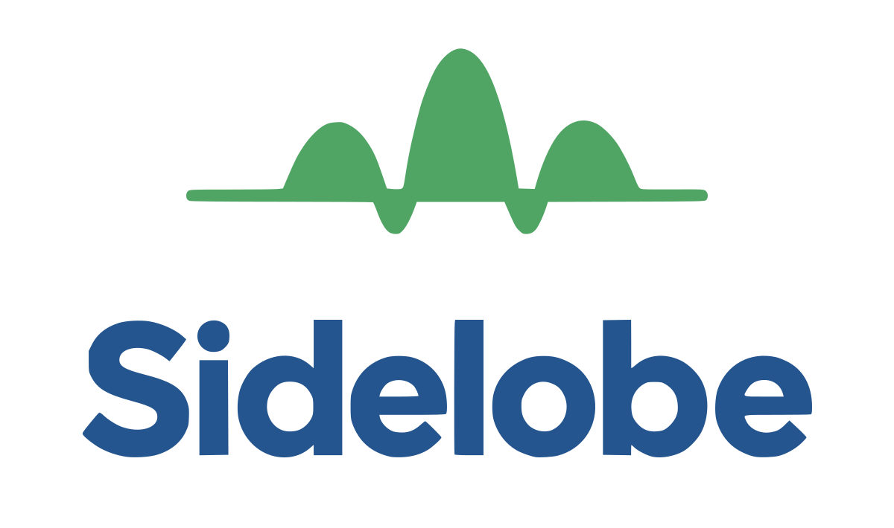

  

  <strong>Focused software. Open-source engineering.</strong> 
  Independent software studio · Europe

  <a href="https://sidelobe.dev">sidelobe.dev</a>
  ·
  <a href="mailto:hello@sidelobe.dev">hello@sidelobe.dev</a>

---

Sidelobe builds focused software and developer tools around problems that deserve a smaller, clearer solution.

Our public work starts with open source: narrow tools with explicit boundaries, maintainable code and evidence behind the claims they make.

## Open source

### RuntimeTruth

**Runtime integrity verification for AI agents.**

RuntimeTruth is a local-first runtime verification CLI for AI agents. It captures declared, resolved and live runtime evidence, compares that state semantically, gates selected invariants through an explicit verification policy, and can bind reviewed baselines to identity-backed Sigstore attestations.

→ [PyPI](https://pypi.org/project/runtimetruth/) · [Case study](https://sidelobe.dev/open-source/runtimetruth/) · [Engineering note](https://artur.panek.tech/notes/ai-agent-config-vs-runtime/) · [Source](https://github.com/sidelobe-labs/runtimetruth) · [Releases](https://github.com/sidelobe-labs/runtimetruth/releases)

Current public scope includes Codex runtime resolution, instruction fingerprints, MCP capability-surface evidence, semantic diff, persisted verification policy, canonical baseline digests, keyless Sigstore attestations and machine-readable CI reports.

## How we build

- **Evidence over inference** — say what can actually be established.
- **Focused scope** — avoid turning every useful tool into a platform.
- **Local-first where it matters** — useful OSS should not require an account or hosted control plane.
- **Explicit boundaries** — security, privacy and support assumptions belong in the repository.
- **Production-minded engineering** — tests, packaging, CI and release hygiene are part of the product.

## Public-project boundary

Public Sidelobe repositories are provided under the license stated in each repository.

Unless a repository explicitly says otherwise, publishing an open-source project does not imply a hosted service, paid support plan, uptime commitment or SLA.

---

  <a href="https://sidelobe.dev">Website</a>
  ·
  <a href="https://github.com/sidelobe-labs">GitHub</a>
  ·
  <a href="mailto:hello@sidelobe.dev">Contact</a>

